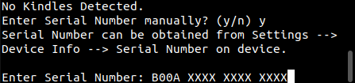
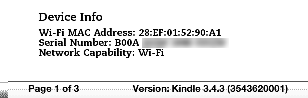

# kindlepass
Audible devices/apps require that a license file be present to allow the playback of audible content.

As it stands, the Audible/Amazon login flow has changed so much that older Kindle models (1, 2, DX & 3), can no longer log in and retrieve this license by themselves.

**kindlepass** is designed to streamline the retrieval of licenses for these devices.

## Features
- Windows / Mac OS / Linux Support
- Auto-detection of plugged-in Kindles on Linux
- Full CLI wizard
- Install licenses directly to device
- Generate activation bytes, allowing native playback and drm removal.

## How to run

### Prerequisites
- Python >=3.6

Download this project by either running `git clone git@github.com:kennedn/kindlepass.git`
or downloading the tarball [here](https://github.com/kennedn/kindlepass/archive/master.zip).
  
You can then run pip install from within the project directory to install kindlepass and dependancies:
```bash
python3 -m pip install .
```
Then run the wizard:
```bash
kindlepass
```
### Serial
If prompted, you can find your Devices serial by Navigating to
Menu --> Settings --> Device Info --> Serial Number:

kindlepass                                       | On Device             	                         
:-----------------------------------------------:|:-----------------------------------------------:
|

### Usage
The tool will present a list of options once auto-detection / serial input is complete:
```bash
#  ACTION                                        
1  Activate device (Will require login to Amazon)
2  Save to Device                                
3  Save to file                                  
4  Print activation bytes                        
5  Exit Program
```
#### Activate device
This option will take you through a list of prompts to login to Amazon. After a successful login, activation will
be retrieved and processed.

#### Save to Device (Linux Only)
This option will allow you to save the `AudibleActivation.sys` file directly to your kindle.

#### Save to File
This option will allow you to save the `AudibleActivation.sys` file to a specific location. This will then need placed
manually on the Kindle device at `ROOT:/system/AudibleActivation.sys`.

#### Print activation bytes
Activation bytes can be used to play .aax files natively or remove DRM entirely, example commands:

Play Natively:
```bash
mpv --demuxer-lavf-o=activation_bytes=XXXXXXXX audiobook.aax
```

Decode to MP3:
```bash
ffmpeg -activation_bytes XXXXXXXX -i audiobook.aax audiobook.mp3
```

### Notes
Kindle auto-detection will not function on Windows and Mac OS systems.
